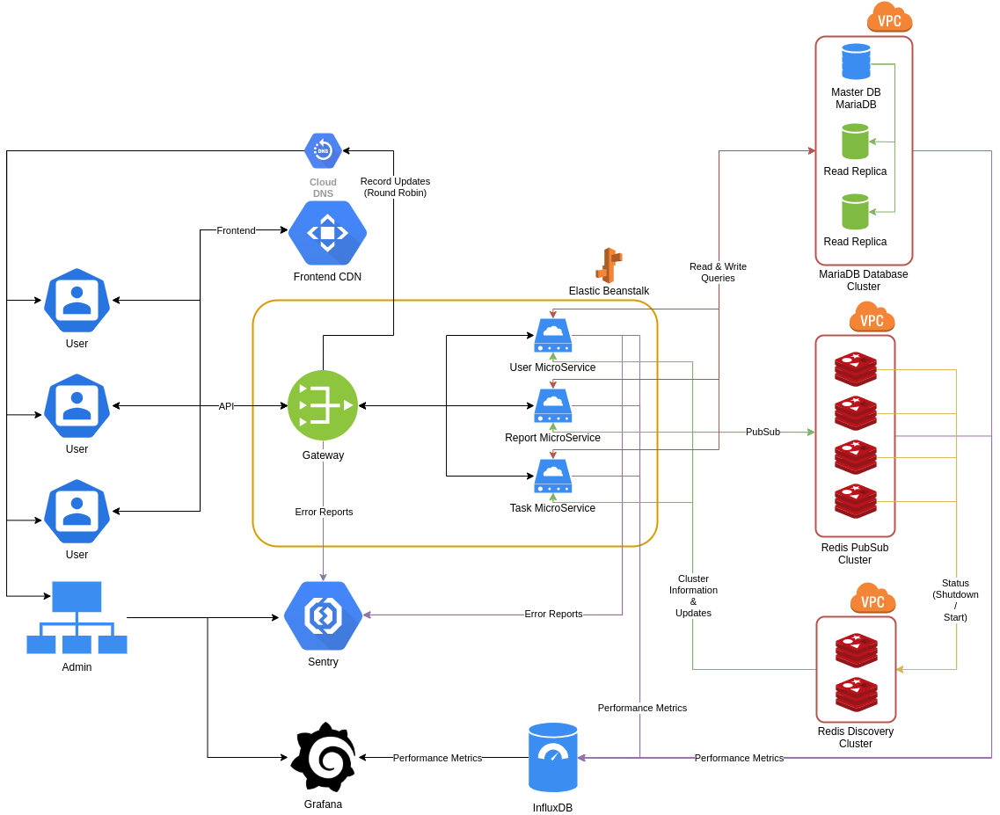

[Home](../../../README) > [Documentation](../documentation) <!-- Breadcrumb -->

# Architecture

## Service Scaling

All of the services in the orange box (Gateway, MicroServices) will scale automatically
based on the load to handle the incoming user traffic.

Every service is cloud native so they won't persist data on their storage - instead they'll send everything to the database.

## Round Robin

Currently our plan is to use Round Robin for Gateway load balancing which enables us to distribute "new" users between the gateway instances.
This strategy also has negative drawbacks, but in general it's more platform independent than saying things like "we use X from company Y".

When we decide to use one specific service, we still could migrate to the provided option.

## Database Cluster

To handle the enormous amount of queries we will use read replicas.
Read replicas handle all the read-operations so that the master instance doesn't have to.

Because of our micro service structure it's also possible to have separated clusters for every micro service.

The only bottleneck currently could be write-operations. Here we have to discuss how to handle these without running into concurrency/persistence problems.

## PubSub Cluster

Because of the Redis PubSub Scaling problems (discussed in [Redis PubSub](/blog/technical/articles/redis-pub-sub)) we use a cluster of independent Redis nodes which distribute messages from every service instance to every service instance which has subscribed to the topic.

The Redis Discovery Cluster in this case is responsible for telling every service to connect to all Redis PubSub instances. Because of that every Redis PubSub instance reports its current state to the Discovery Cluster (e.g. shutdown, startup).

## Frontend CDN

Today it's common practice to use CDNs for static content. In our case we have a server side rendered React frontend which we plan to deliver using CDNs.

The great advantages of CDNs are the price (just paying for traffic) and the performance because of the distance to the user.

### [Back](../../../README)
